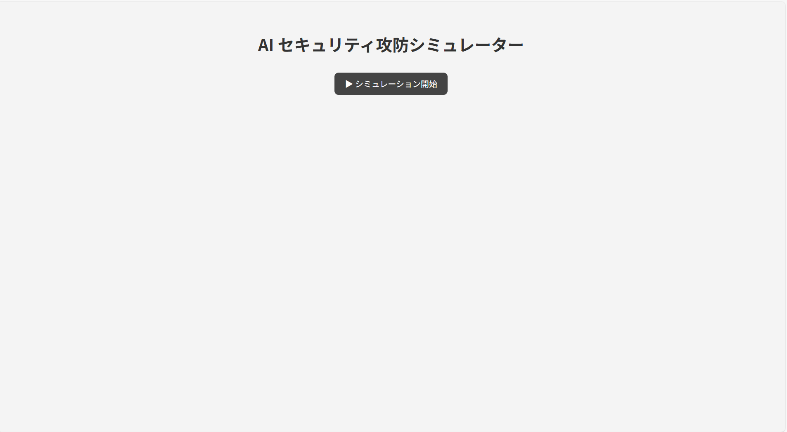
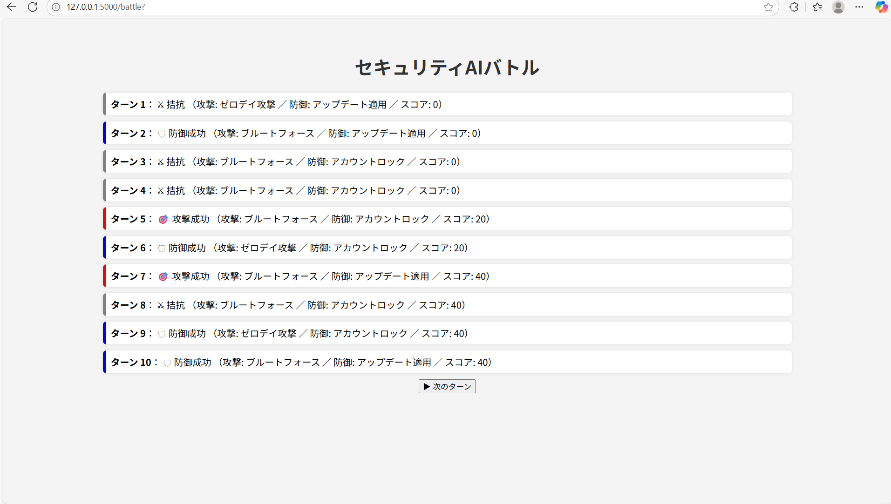
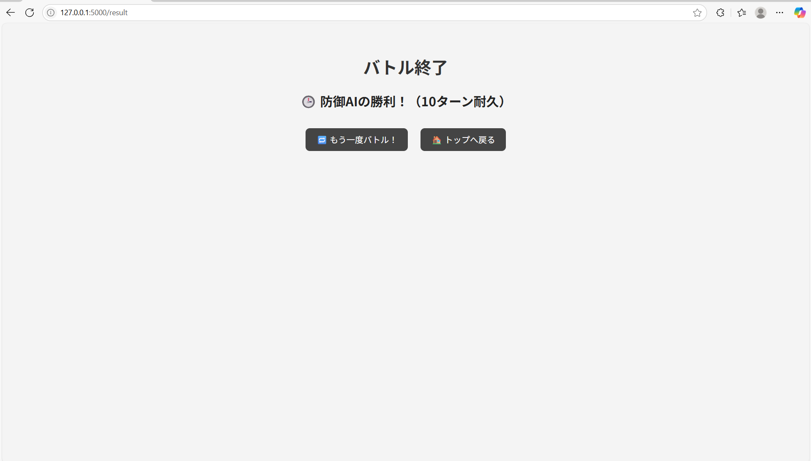

# Security AI Battle

AI同士が攻防を繰り広げる、セキュリティ攻防シミュレーションゲームです。  
Flaskを使用したWebアプリとして動作し、攻撃AIと防御AIが10ターンのバトルを行います。

---

## 特徴

- **攻撃AI vs 防御AI** の自動バトル（10ターン制）
- 1ターンずつ進めるインタラクティブな操作
- 勝敗条件：
  - 攻撃AIがスコア100を超えたら勝利
  - 防御AIが10ターン耐久または攻撃AIを無力化したら勝利
- バトルログを `log.txt` に自動保存
- 統計ページで **試合数・勝率・平均スコア** を確認可能
- 再戦ボタンで即リトライ

---

## デモ画面

### トップ画面


### バトル画面


### 結果画面


### 統計ページ


---

## セットアップ方法

1. リポジトリをクローンします：

```bash
git clone https://github.com/your-username/security-ai-battle.git
cd security-ai-battle
```
---

## 今後のアップデート予定

- 統計ページ&グラフ表示を追加予定
- カスタムテーマ（カエル vs 蛇の演出など）を検討中
- パラメータ設定フォーム（ターン数や初期攻撃力の調整）

---

## 自分用
http://127.0.0.1:5000
